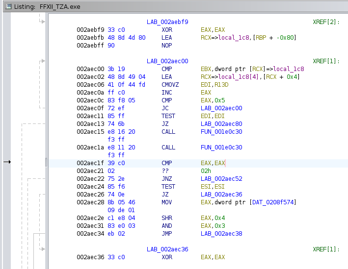

# Force Playstation Buttons for Final Fantasy 12: The Zodiac Age

## What is this?

This is a hard patch for Final Fantasy 12: The Zodiac Age for PC that you apply to the game executable to force Playstation button prompts.

## Introduction/Screed

Final Fantasy XII: The Zodiac Age is unfortunately one of those games that tries to outsmart you and doesn't offer you the choice to use whatever button promps you want. This causes problems if, for example, you need Steam Input for your Playstation controller which causes the game to see an XBox-style controller and there is no way to override the settings. It's also just annoying if you really like the Playstation buttons the most, and want to use the button prompts that the original version of the game used!

For some reason, despite being marketed as a device that is open to tinkering and customization, Valve in its infinite wisdom has not provided any way to have the Steam Deck controller identify to games as a different style of controller, leaving solutions to this problem to individual games, many of which obnoxiously use some kind of autodect method that can't be overridden. Personally, I have modded my Steam Deck to have Playstation symbol buttons, so this is a constant thorn in my side. Final Fantasy XII: The Zodiac Age is one such game.

## What does this patch do?

This patch modifies one instruction in the Final Fantasy XII executable at address 002AEC1F that is looking to see if the value in the EAX register matches the identifier for Playstation-style controllers. This line is changed to compare the EAX register to itself instead of zero, which thus passes the check as to whether the connected controller is a Playstation controller.

## How do I use it?

You will need to use the open source patching tool bsdiff to patch the executable file. Your package manager should have this available in any distro. I do not use Windows so I do not know how to use it in Windows, but I believe there is a way to do so. You can apply this patch on one computer and copy the executable to the device running it, which is great for devices like the Steam Deck, and exactly how I created this patch in the first place.

You will need to modify the `FFXII_TZA.exe` file in the `x64` folder of your Steam install for The Zodiac Age. On the Steam Deck, this is generally located at:

`/home/deck/.local/share/Steam/steamapps/common/FINAL FANTASY XII THE ZODIAC AGE/x64/FFXII_TZA.exe`

First and foremost, make a backup of the original file!

`x64/# mv FFXII_TZA.exe FFXII_TZA.original.exe`

Now, apply the patch to your copy and output as the filename that will launch with the game. Be sure to use the path to the patch file and not the example text!

`x64/# bspatch FFXII_TZA.original.exe FFXII_TZA.exe \path\to\TZA_psbuttons.bsdiff`

You can move or copy the patched `FFXII_TZA.exe` to any device you want to run the game on with Playstation button prompts, so you do not need to worry about trying to do this process on a Steam Deck or something like that.

## Can I modify or do whatever with this patch?

Yes! Even if you're a weird freak that wants to do some thing something gross, like force XBox buttons. 😄 It shouldn't be difficult to find and use modifications to make software accessible and usable for you, especially when lack of accessibility should not exist in the first place. I am also willing to consider any pull requests for extra functionality, or a much less manual method for applying this patch. You can also just fork this repo and do whatever.

## Warranty

None whatsoever. This was a one off thing that worked for me, it may or may not work for you.